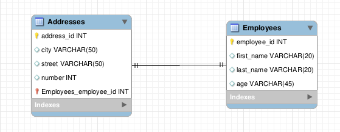

## Relacionamento 1:1


### Configurar o sequelize

### Instalar dependências
```bash
npm i -E express@4.17.1 nodemon@2.0.15
```

### Criar a migration `Employees`
```bash
npx sequelize migration:generate --name create-employees
```
### Configurando migration `Employees`
```bash
// src/migrations/[timestamp]-create-employee.js

module.exports = {
  up: async (queryInterface, Sequelize) => {
    return queryInterface.createTable('employees', {
      id: {
        allowNull: false,
        autoIncrement: true,
        primaryKey: true,
        type: Sequelize.INTEGER,
      },
      firstName: {
        allowNull: false,
        type: Sequelize.STRING,
        field: 'first_name',
      },
      lastName: {
        allowNull: false,
        type: Sequelize.STRING,
        field: 'last_name',
      },
      age: {
        allowNull: false,
        type: Sequelize.INTEGER,
      },
    });
  },

  down: async (queryInterface, _Sequelize) => {
    return queryInterface.dropTable('employees');
  },
};
```
### Criar a migration `Addresses`
```bash
npx sequelize migration:generate --name create-addresses
```
### Configurando a migration `Addresses`
```bash
// src/migrations/[timestamp]-create-addresses.js

module.exports = {
  up: async (queryInterface, Sequelize) => {
    return queryInterface.createTable('addresses', {
      id: {
        allowNull: false,
        autoIncrement: true,
        primaryKey: true,
        type: Sequelize.INTEGER,
      },
      city: {
        allowNull: false,
        type: Sequelize.STRING,
      },
      street: {
        allowNull: false,
        type: Sequelize.STRING,
      },
      number: {
        allowNull: false,
        type: Sequelize.INTEGER,
      },
      employeeId: {
        type: Sequelize.INTEGER,
        allowNull: false,
        // Configuram o que deve acontecer ao atualizar ou excluir um usuário
        onUpdate: 'CASCADE',
        onDelete: 'CASCADE',
        field: 'employee_id',
        // Informa que o campo é uma Foreign Key (Chave estrangeira)
        references: {
          // Informa a tabela da referência da associação
          model: 'employees',
          // Informa a coluna da referência que é a chave correspondente
          key: 'id',
        },
      },
    });
  },

  down: async (queryInterface, _Sequelize) => {
    return queryInterface.dropTable('addresses');
  },
};
```
### Subindo os container docker
```bash
docker compose up -d --build
```
### Criar o banco de dados
```bash
npx sequelize db:create
```
### Criando tabelas no banco de dados
```bash
npx sequelize db:migrate
```

### Crie o arquivo `src/models/employee.model.js` para relacionar as tabelas

### Configure o arquivo `employee.model.js`
```bash
module.exports = (sequelize, DataTypes) => {
  const Employee = sequelize.define('Employee', {
    id: { type: DataTypes.INTEGER, primaryKey: true, autoIncrement: true },
    firstName: DataTypes.STRING,
    lastName: DataTypes.STRING,
    age: DataTypes.INTEGER,
  },
  {
    timestamps: false, // remove a obrigatoriedade de utilizar os campos `createdAt` e `updatedAt`
    tableName: 'employees',
    underscored: true,
  });

  Employee.associate = (models) => {
    Employee.hasOne(models.Address,
      { foreignKey: 'employeeId', as: 'addresses' });
  };

  return Employee;
};
```
### Crie o arquivo `src/models/address.model.js` para relacionar as tabelas

### Configure o arquivo `address.model.js`
```bash
module.exports = (sequelize, DataTypes) => {
  const Address = sequelize.define('Address', {
    id: { type: DataTypes.INTEGER, primaryKey: true, autoIncrement: true },
    city: DataTypes.STRING,
    street: DataTypes.STRING,
    number: DataTypes.INTEGER,
    employeeId: { type: DataTypes.INTEGER, foreignKey: true },
    // A declaração da Foreign Key é opcional no model
  },
  {
    timestamps: false,
    tableName: 'addresses',
    underscored: true,
  });

  Address.associate = (models) => {
// define o tipo de relacionamento
    Address.belongsTo(models.Employee,
    // define qual a foreign key a ser criada
      { foreignKey: 'employeeId', as: 'employees' });
  };

  return Address;
};
```

### Métodos de associação do sequelize
```
hasOne
belongsTo
hasMany
belongsToMany
```
### Criar o Seed da tabela `Employees`
```bash
npx sequelize seed:generate --name employees
```
### Configure a `seeders 'Employees'`
```bash
module.exports = {
  up: async (queryInterface, _Sequelize) => {
    return queryInterface.bulkInsert('employees',
      [
        {
          first_name: 'Marcos',
          last_name: 'Zuck',
          age: 49,
        },
        {
          first_name: 'Fred',
          last_name: 'Mercúrio',
          age: 19,
        },
        {
          first_name: 'Ayrton',
          last_name: 'Keno',
          age: 51,
        },
        {
          first_name: 'Robin',
          last_name: 'Mathias',
          age: 63,
        },
      ],
      {},
    );
  },

  down: async (queryInterface, _Sequelize) => {
    return queryInterface.bulkDelete('employees', null, {});
  },
};
```
### Criar o Seed da tabela `Address`
```bash
npx sequelize seed:generate --name addresses
```
### Configure a ``Seeders 'Address'`
```bash
module.exports = {
  up: async (queryInterface, _Sequelize) => {
    return queryInterface.bulkInsert('addresses',
      [
        {
          city: 'Belo Horizonte',
          street: 'Rua Flórida',
          number: 1080,
          employee_id: 1,
        },
        {
          city: 'São Paulo',
          street: 'Avenida Paulista',
          number: 1980,
          employee_id: 2,
        },
        {
          city: 'Fortaleza',
          street: 'Rua das Enseadas',
          number: 95,
          employee_id: 3,
        },
        {
          city: 'Belo Horizonte',
          street: 'Rua Andaluzita',
          number: 131,
          employee_id: 4,
        },
        {
          city: 'Curitiba',
          street: 'Rua Fria',
          number: 101,
          employee_id: 4,
        },
      ],
      {},
    );
  },

  down: async (queryInterface, _Sequelize) => {
    return queryInterface.bulkDelete('addresses', null, {});
  },
};
```
### Executar todas as `Seeds` pendentes
```bash
npx sequelize db:seed:all
```

## Configurando o servidor `rodando no nodemon`

### Crie o arquivo `src/services/employee.service.js`
```bash
const { Address, Employee } = require('../models/');

const getAll = async () => {
  const users = await Employee.findAll({
    include: { model: Address, as: 'addresses' },
  });

  return users;
};

module.exports = { getAll };
```

### Crie o arquivo `src/controllers/employee.controller.js`
```bash
const EmployeeService = require('../services/employee.service');

const getAll = async (_req, res) => {
  try {
    const employees = await EmployeeService.getAll();
    return res.status(200).json(employees);
  } catch (e) {
    console.log(e.message);
    res.status(500).json({ message: 'Ocorreu um erro' });
  }
};

module.exports = {
  getAll,
};
```

### Crie o arquivo `src/app.js`
```bash
const express = require('express');

const employee = require('./controllers/employee.controller');

const app = express();

app.use(express.json());

app.get('/employees', employee.getAll);

module.exports = app;
```

### Crie o arquivo `src/server.js`
```bash
const app = require('./app');

const PORT = process.env.PORT || 3003;

app.listen(PORT, () => {
  console.log(`Escutando na porta ${PORT}`);
});
```

### Configure o arquivo `package.json`
```bash
 "main": "src/server.js",
  "scripts": {
    "dev": "nodemon src/server.js"
```
### Inicie o servidor
```bash
npm run dev
```

### Faça uma requisição `GET` no endpoint `http://localhost:3003/employees`